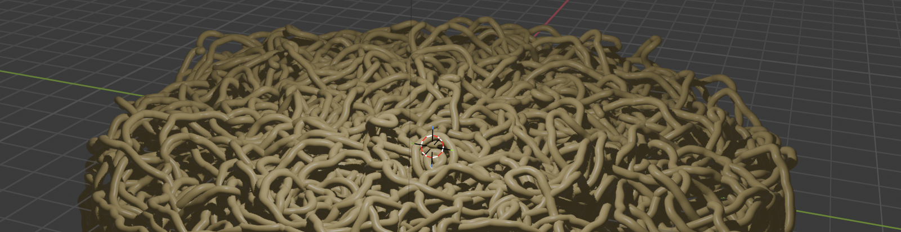
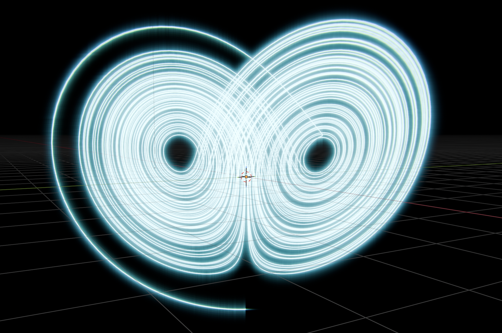
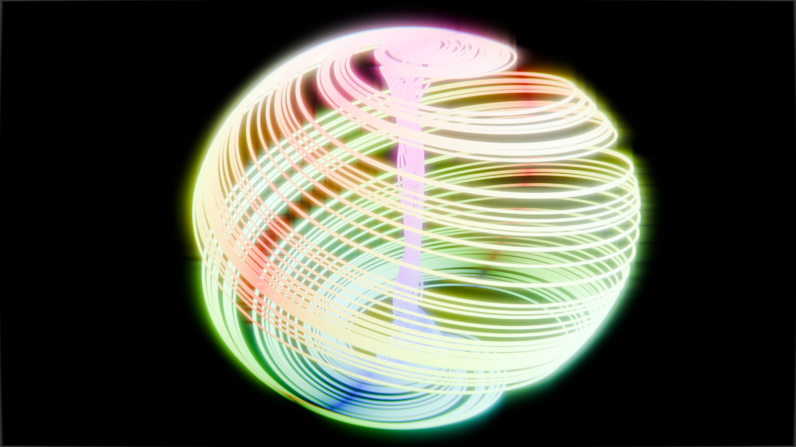
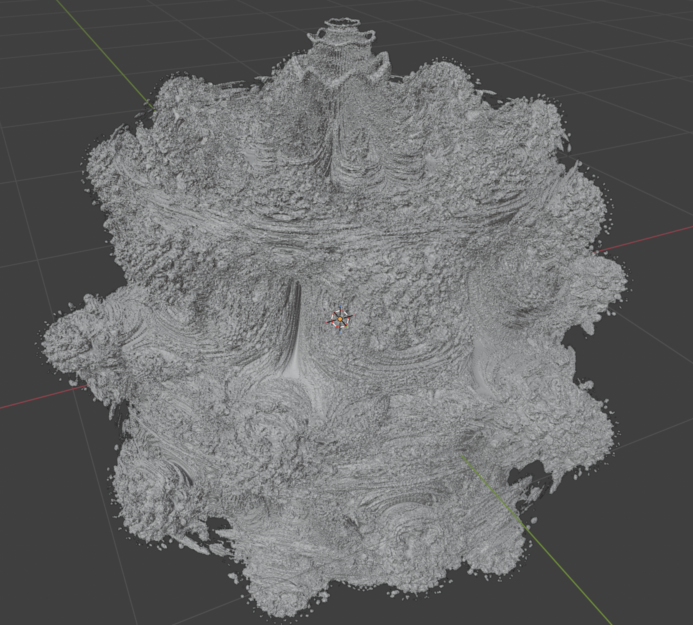

# ramen

`ramen` is a toy for generating Blender geo, shader, and compositor nodes in Rust.



- Blender 5+
- pre-v0.0.1

## Examples

### 1. Lorenz Attractor



[code](examples/ex08_lorenz_attractor.rs)

### 2. Aizawa Attractor



[code](examples/ex09_aizawa_attractor.rs)

### 3. Mandelbulb



[code](examples/ex05_mandelbulb_1.rs)

## Usage

Requires Blender 5.0+, Rust, and Python.

> [!NOTE]
> **Currently, manual setup is required.**

### pre-setup

1. Clone this repository.
2. Run the following commands in the project root:

```shell
{Blender Executable} --background --factory-startup --python dump_nodes.py  # This generates `blender_nodes_dump.json`.
cargo build  # This includes macro generation to handle Blender nodes.
```

### Edit Code and Generate Nodes

#### For First-Time Users

1. Launch Blender along with the script-receiving server using the following command. The port is `8080`, which is hardcoded in `server.py` and `live_link.rs`.
```shell
{Blender Executable} --python server.py
```
2. **With an active object selected**, run the sample code you want to execute as shown below. This will add a geometry nodes modifier to the target object, as well as create shader and compositor nodes.
```shell
cargo run --example ex08_lorenz_attractor
```

#### Once You Get Used to It

Edit the samples above, or create and run your own file containing a `main` function.

Hints:
* Using code completion in an IDE is highly recommended. (To be honest, implementing this by guessing without it is impossible, and AI will be mostly useless lol)
* We use Blender's `bl_idname` as the struct name. Blender's namespace is a bit quirky—especially nodes with the `ShaderNode` prefix (e.g., `ShaderNodeSeparateXyz`), which are frequently used in geometry and compositor nodes. If you're unsure, it's best to check the dev tooltip from the Blender GUI.
* We attempt to auto-generate socket numbers (`PIN_xxx`) and items that can be represented as Enums. Try playing around with code completion while referencing the code in the `examples` directory.

## Notes

- Arbitrary code execution from localhost is allowed via the Blender Server. So, please ensure that this tool is only used in a trusted local development environment.
